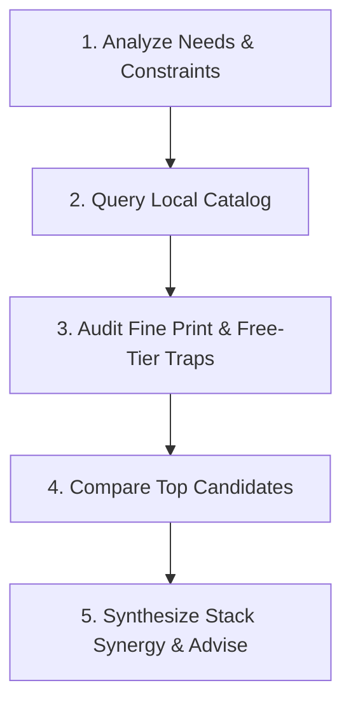

# Free Developer Resources & Zero-Cost Architecture

Find, evaluate, and combine free-tier services (SaaS, PaaS, IaaS, BaaS, APIs, tooling) from the curated [free-for.dev](https://free-for.dev) repository (`resource-repo/README.md`).

This catalog contains over 1,300 services across 57 infrastructure and developer tooling categories. Every listed service offers a legitimate, non-trial free tier (or a free tier lasting at least one year) with TLS/HTTPS support.

---

## When to Use This Skill

Activate this skill whenever:
- A user asks for **free cloud infrastructure, hosting, databases, APIs, or SaaS tools** (e.g., *"Where can I host a Python API for free?"*, *"What free Postgres database should I use?"*, *"Free transactional email service?"*).
- Designing a **zero-dollar / zero-budget architecture** for a proof-of-concept, side project, MVP, hackathon, or hobby site.
- Looking for **free alternatives** to commercial services (e.g., free alternatives to Heroku, AWS, SendGrid, Auth0, Sentry, ngrok).
- Filtering offerings by strict constraints, such as **no credit card required**, **custom domain support**, **never sleeps / no cold starts**, or **EU/GDPR hosting**.
- Exploring specialized free developer offerings (e.g., screenshot APIs, feature flags, status pages, mobile CI/CD, geocoding, error monitoring).

---

## Catalog Location & Fast CLI Search

The ground truth catalog is located locally at:
`skills/information/free-dev-resources/resource-repo/README.md`

Use the bundled Python helper script (`scripts/search_resources.py`) to query the catalog programmatically without reading 1,700 lines into LLM context:

```bash
# Keyword search across name, category, and description
uv run python skills/information/free-dev-resources/scripts/search_resources.py search "postgres"

# Filter by keyword AND require no credit card
uv run python skills/information/free-dev-resources/scripts/search_resources.py search "email" --no-card

# Filter by category
uv run python skills/information/free-dev-resources/scripts/search_resources.py search "container" -c "PaaS"

# List all resources in a category
uv run python skills/information/free-dev-resources/scripts/search_resources.py category "Managed Data Services"

# List all 57 categories with entry counts
uv run python skills/information/free-dev-resources/scripts/search_resources.py categories

# Inspect a specific service by name
uv run python skills/information/free-dev-resources/scripts/search_resources.py inspect "Supabase"

# Output as JSON for programmatic pipelines
uv run python skills/information/free-dev-resources/scripts/search_resources.py search "redis" --json
```

---

## 5-Step Recommendation Workflow

When a user asks for free resources or architecture advice, follow this systematic workflow:



### Step 1: Analyze Requirements & Hard Constraints
Determine:
1. **Workload Nature**: Static site, SSR web app, containerized service, background cron worker, relational DB, vector store, or microservice.
2. **Traffic & Storage Scale**: Expected requests/day, database storage size, monthly bandwidth/egress.
3. **Friction Barriers**:
   - Is a credit card acceptable for identity verification, or is **no credit card** mandatory?
   - Can the service tolerate cold starts / idle spin-down (e.g., 15-minute sleep)?
   - Is a **custom domain with free SSL** required?
   - Are there geographic/compliance requirements (e.g., EU data residency)?

### Step 2: Query the Catalog
Run `search_resources.py` with the appropriate keywords or category filters, or inspect the specific category section in `resource-repo/README.md`.

### Step 3: Audit the Fine Print ("The Free Tier Traps")
Always evaluate and warn the user about these common limitations:
- **Idle Sleeping / Cold Starts**: PaaS services (e.g., Render, Koyeb, SnapDeploy, faable) often spin down containers after 15–60 minutes of inactivity. First requests after sleep incur 30–60s latency.
- **Project Pausing**: Cloud databases (e.g., Supabase, Neon) may pause inactive projects after 7 to 30 days without queries. Restoring requires waking the dashboard or hitting the API.
- **Credit Card Requirement**: Some free tiers require a valid credit card up front (e.g., Oracle Cloud Always Free, AWS, Brave Search API), whereas others only require GitHub OAuth or email (e.g., Turso, Fly.io, Resend, Vercel).
- **Hard Quota Cutoff vs. Surprise Billing**: Does the platform halt service cleanly when limits are reached, or automatically transition to billable pay-as-you-go?
- **Egress & Bandwidth Costs**: Free compute often comes with modest bandwidth (e.g., 1 GB to 100 GB/month). Pairing with Cloudflare for caching or Cloudflare R2 for zero-egress object storage prevents bandwidth exhaustion.
- **Custom Domain Entitlement**: Some platforms exclude custom domains from their free tier (e.g., ampt.dev, Val Town).

### Step 4: Compare Primary vs. Alternative
Always present:
- **Primary Pick**: The best overall fit based on developer experience, stability, and generous quotas.
- **Alternative Pick**: The best choice under an opposing trade-off (e.g., *No-Credit-Card* alternative, or *Always-On / No-Sleep* alternative).

### Step 5: Synthesize Stack Synergy
When recommending a service, suggest compatible zero-cost companion services that solve adjacent needs (e.g., pairing a static frontend on Cloudflare Pages with a serverless backend on Cloud Run and a database on Neon).

---

## Category Reference Map

The catalog is divided into 57 categories. Key categories and their primary developer use cases:

| Domain | Catalog Categories in `README.md` | Common Developer Use Cases |
| :--- | :--- | :--- |
| **Compute & Hosting** | `Major Cloud Providers`, `PaaS`, `BaaS`, `Web Hosting`, `IaaS` | Hosting APIs, Docker containers, web frontends, serverless functions, background workers. |
| **Data & Storage** | `Managed Data Services`, `Storage and Media Processing` | PostgreSQL, MySQL, Redis, SQLite at edge, MongoDB, S3-compatible buckets, image optimization. |
| **Auth & Security** | `Authentication, Authorization, and User Management`, `Security and PKI` | User sign-up/login, JWT sessions, MFA, OAuth, secrets management, SSL certificates. |
| **Communication** | `Email`, `Messaging and Streaming`, `Forms` | Transactional emails, contact forms, push notifications, WebSocket streaming, message queues. |
| **AI & Search** | `Generative AI`, `APIs, Data, and ML`, `Search` | LLM inference, embeddings, vector search, web scraping, geocoding, document conversion. |
| **DevOps & CI/CD** | `CI and CD`, `Code Quality`, `Artifact Repos`, `Package Build System` | GitHub/GitLab automation, linting, Docker registries, testing pipelines. |
| **Observability** | `Monitoring`, `Log Management`, `Crash and Exception Handling` | Uptime pinging, APM, error tracking, structured logging, status pages. |
| **Networking** | `DNS`, `Tunneling, WebRTC, Web Socket Servers`, `CDN and Protection` | Localhost exposure (ngrok alternatives), DDoS protection, edge routing. |
| **Productivity** | `Issue Tracking and Project Management`, `Tools for Teams`, `IDE and Code Editing` | Cloud IDEs (Cloud Shell, Colab, IDX), Kanban boards, documentation, team chats. |

---

## Curated Zero-Dollar Architecture Blueprints

Use these battle-tested, zero-cost architecture combinations for common project types:

### 1. The Modern Full-Stack Web App (Next.js / SvelteKit / Nuxt)
- **Frontend & Edge Hosting**: **Cloudflare Pages** (Unlimited requests, 500 builds/month, custom domains with free SSL) or **Vercel** (Hobby plan, 100 GB bandwidth).
- **Relational Database**: **Neon** (Serverless PostgreSQL, 0.5 GB storage, branching) or **Supabase** (Postgres, 500 MB DB, Auth, Realtime, Storage).
- **Authentication**: **Clerk** (10,000 monthly active users free) or **Supabase Auth** (50,000 MAU free).
- **Object Storage**: **Cloudflare R2** (10 GB storage, $0 egress fees) or **Backblaze B2** (10 GB free).
- **Transactional Email**: **Resend** (3,000 emails/month, 100/day) or **Brevo** (300 emails/day).

### 2. The Python / Go / Node Containerized API & Background Worker
- **Container / API Compute**: **Google Cloud Run** (2 million requests/month, 360,000 GB-seconds memory, 180,000 vCPU-seconds) or **Fly.io** (free allowance for small instances).
- **PaaS Alternative (with sleep)**: **Render** (Free web service with 15m idle spin-down) or **Koyeb** (1 nano service).
- **Edge / Embedded Database**: **Turso** (SQLite at edge, 9 GB storage, 500 DBs, $0) or **MongoDB Atlas** (M0 cluster, 512 MB storage).
- **Key-Value Cache & Queue**: **Upstash** (Serverless Redis: 10,000 commands/day free; QStash: 500 messages/day for background tasks).
- **Cron Triggers**: **cron-job.org** (Unlimited scheduled webhook pings) or **Cronhooks** (5 scheduled webhooks).

### 3. The Generative AI & RAG Agent Stack
- **LLM Inference**: **Google AI Studio** (Gemini 2.5/3.5 Flash free tiers with high RPM) or **Groq Cloud** (ultra-fast Llama-3/Mistral inference free tier).
- **Vector Search / Knowledge Store**: **Qdrant Cloud** (1 GB managed cluster free) or **Pinecone** (Starter 1 index, up to 100k vectors) or **Neon / Supabase pgvector**.
- **Web Context / Search API**: **Brave Search API** ($5 monthly free credits) or **Tavily / Exa** free developer tier.
- **Workflow & Scraper**: **Apify** ($5/month platform credits for pre-built scrapers) or **Browserless / PhantomJsCloud** (500 pages/day free).

### 4. Static Landing Page / Portfolio with Interactive Contact Form
- **Static Hosting**: **GitHub Pages** or **Cloudflare Pages** (unlimited bandwidth on CDN).
- **Forms Backend**: **Formspree** (50 submissions/month) or **Web3Forms** (Unlimited forms, no account required, sends directly to email).
- **Analytics (Privacy-Friendly)**: **Umami Cloud** or **Cloudflare Web Analytics** (Zero cookies, 100% free).
- **Status & Uptime**: **UptimeObserver** (20 monitors, 5-minute interval, status page) or **Better Stack (Uptime)**.

### 5. Localhost Development & Webhook Debugging
- **Tunneling**: **Cloudflare Tunnel / cloudflared** (Unlimited, free forever, custom domains supported) or **LocalXpose** / **ngrok** (free tier with ephemeral URLs).
- **Webhook Inspector**: **AnyHook** (3,000 events/month, automatic retries) or **Beeceptor** (50 requests/day, instant mock endpoints).

---

## Standard Recommendation Output Template

When delivering free resource recommendations to the user, format responses using this clear structure:

```markdown
### 🌟 Top Recommendation: [Service Name](URL)
- **Category**: [e.g. Managed Data Services / PostgreSQL]
- **Free Tier Allowance**: [e.g., 500 MB storage, 1 vCPU, 20 concurrent connections]
- **Why It's Ideal**: [Specific rationale matching the user's stack and scale]
- **Account Requirements**: [e.g., No credit card required / GitHub OAuth signup]
- **⚠️ Important Gotchas**: [e.g., Project pauses after 7 days of inactivity; manual resume via dashboard]

### 🔄 Alternative Option: [Service Name](URL)
- **Key Trade-off**: [e.g., Never sleeps, but requires credit card verification up front]
- **Free Tier Allowance**: [Exact quotas]
- **Best Suited For**: [Specific scenario where this option is preferable]

### 🧩 Recommended Stack Pairings
- **Companion Service 1**: [Service Name & role, e.g., Cloudflare R2 for zero-egress asset storage]
- **Companion Service 2**: [Service Name & role, e.g., Resend for transactional verification emails]
```

---

## Maintenance & Verifying Changes

- The catalog submodule/directory is at `skills/information/free-dev-resources/resource-repo/`.
- If new services are pulled into `resource-repo/README.md`, re-run `scripts/search_resources.py categories` to confirm parsing integrity.
- Run tests with:
  ```bash
  uv run pytest skills/information/free-dev-resources/tests/
  uv run ruff check skills/information/free-dev-resources/
  ```
